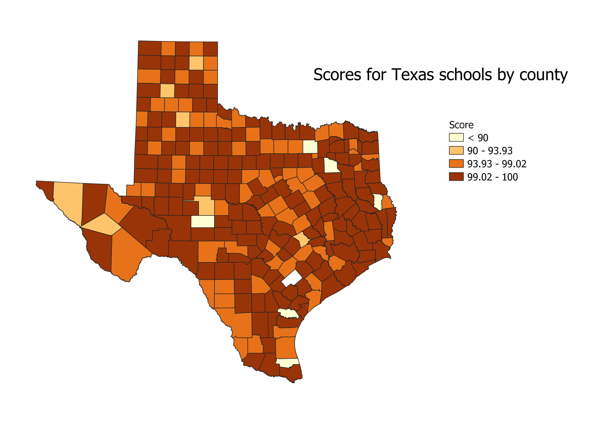
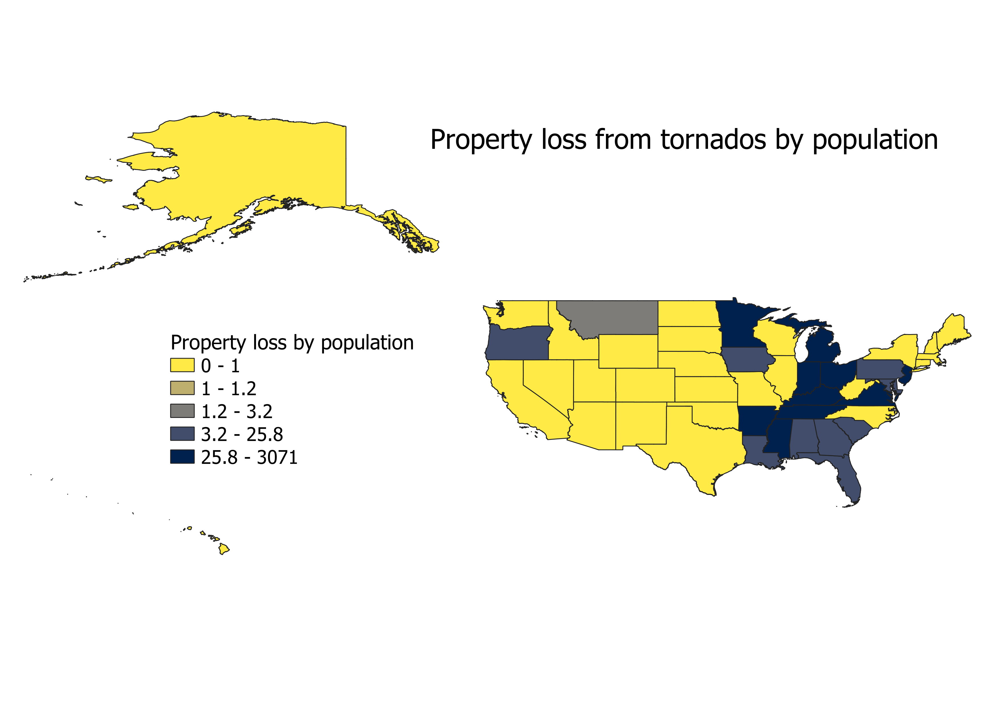

# finalexampractice

<!-- // <!DOCThYPE html> -->
<html lang="en">
<head>
    <meta charset="UTF-8">
    <meta name="viewport" content="width=device-width, initial-scale=1.0">
    <title>Homework 6</title>
</head>
<body>
<h1>My practice map for HW 6.1</h1>
<h2>Madeline Scott</h2>
<h3>This map depcits the school rating for all counties in Texas. </h3>
<!-- Your map goes here -->

<!-- Link to your shapefile in Github and you CSV -->
<h2>Data used for this project</h2>
    <a href="./maps/cleaned2.csv"> CSV dataset </a>
    

    <a href="https://github.com/mscott2000/finalexampractice/blob/main/state.geojson"> Link to state vector </a>

    <h1>My practice map for HW 6.2</h1>
<h2>Madeline Scott</h2>
<h3>This map depcits tornado damage as a ratio of state population.  </h3>
<!-- Your map goes here -->

<!-- Link to your shapefile in Github and you CSV -->
<h2>Data used for this project</h2>
    <a href="./maps/tornado.csv"> CSV dataset </a>
    

    <a href="https://github.com/mscott2000/finalexampractice/blob/main/us_states.geojson"> Link to state vector </a>

</body>
</html>